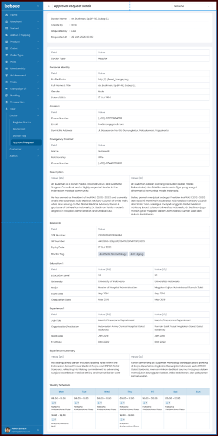
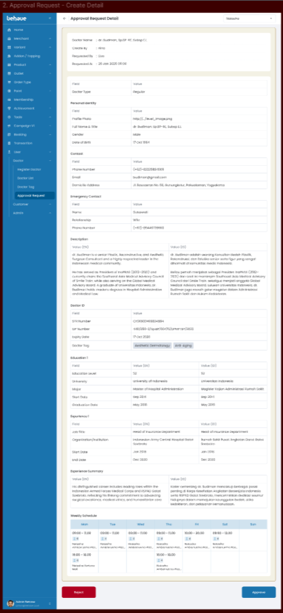

# Create UI Detail Create Doctor Request
## 1. Overview
Menampilkan data request create yang digunakan untuk membuat data doctor baru. Ada 2 sisi yaitu sebagai 'Maker' dan 'Approval'
## 2. Requirement Visual
- **Tampilan User Maker**

	
- **Tampilan User Approval**

	
## 3. Logic UI / UX
- **Loading:** Saat load halaman maka berikan loader spinner.
- **Maker/Approval:** Tampilan request didapat dari role pada user yang sedang login(jwt, session).