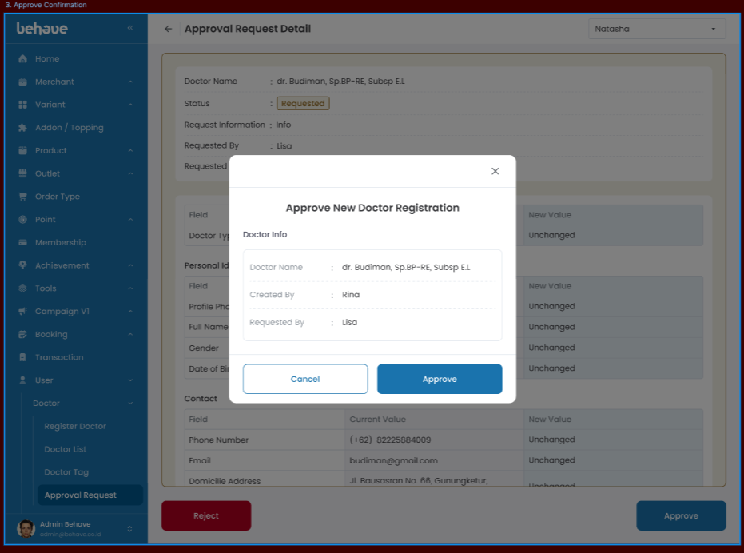
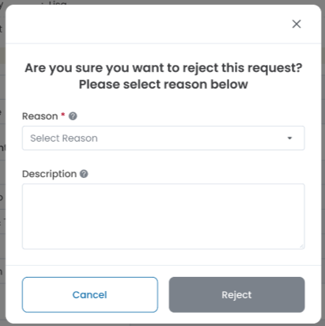
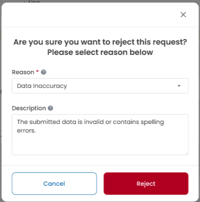

# Detail Create Doctor Request
## Overview
Menampilkan data request create yang digunakan untuk membuat data doctor baru. Ada 2 sisi yaitu sebagai 'Maker' dan 'Approval'. User aprroval dapat melakuakn action 'Approve' dan 'Reject'
## Requirement Visual
- **Tampilan User Maker**

	
- **Tampilan User Approval**

	

	
- **Tampilan Approve Confirmation*
  
  
  
- **Tampilan Reject Confirmation** 

	

- **Tampilan Reject Consirmation(Terisi)** 

	
## Logic UI / UX
- **Loading:** Saat melakukan load halaman maka berikan loader spinner.
- **Maker/Approval:** Tampilan UI request didapat dari key role pada user yang sedang login( melalui jwt, session).
## API Needs
- `API Get Detail Create Doctor Request`
-  `API Approval Create Doctor Request`
- `API Reject Create Doctor Request blom terdefine mas bintang`