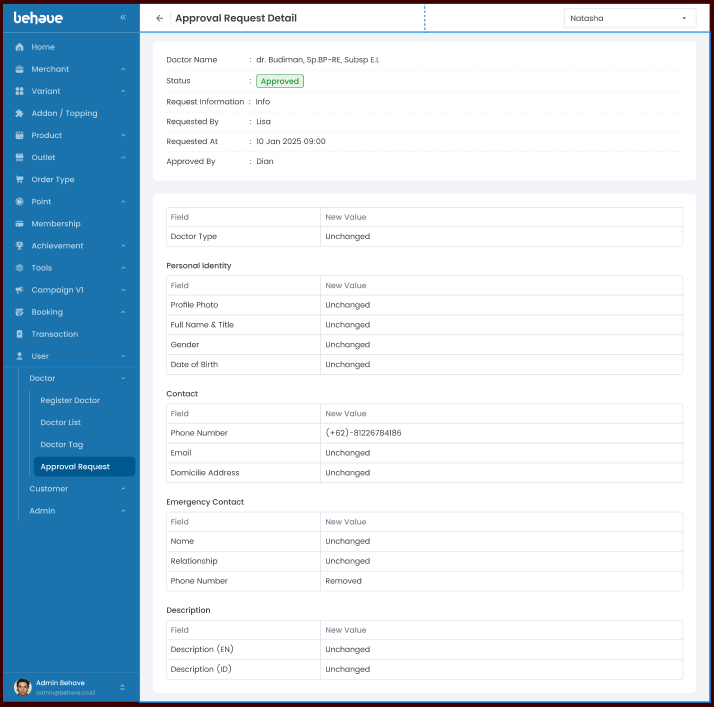
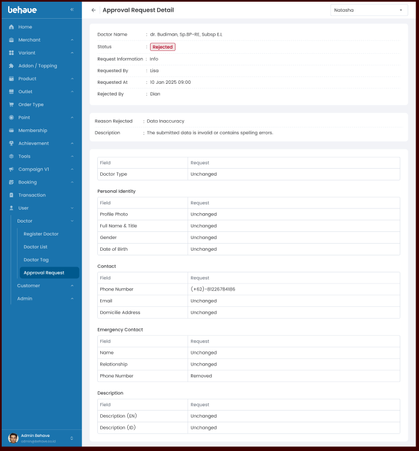

# Detail History Update Doctor Request
## 1. Overview
Menampilkan data request update history untuk mengecek data apa saja yang di update. Ada 2 sisi yaitu sebagai 'Maker' dan 'Approval'. 
## 2. Requirement Visual

- **Tampilan Update History Accepted**

	

-  **Tampilan Update History Rejected**

	
## 3. Logic UI / UX
- **Loading:** Saat melakukan load halaman maka berikan loader spinner.
- **Maker/Approval:** menampilkan halaman yang sama.
## 4. API Needs
- `API Get Detail History Update Doctor Request`