# Detail Update Doctor Request
## Overview
Menampilkan data request update yang digunakan untuk membuat data doctor baru. Ada 2 sisi yaitu sebagai 'Maker' dan 'Approval'. 
## Requirement Visual
- **Tampilan User Maker Request Update Detail Info**

	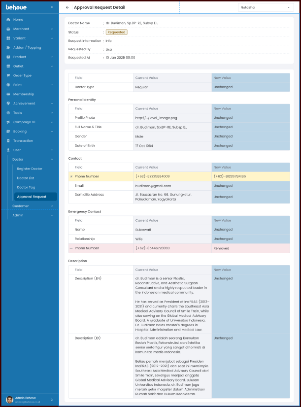

-  **Tampilan User Maker Request Update Detail Professioal & Exp**

	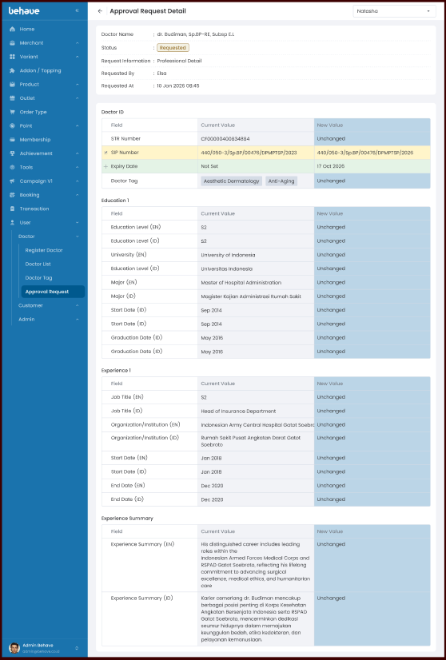
- **Tampilan User Maker Request Update Weekly Schedule**

	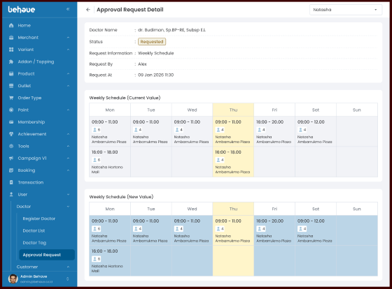
- **Tampilan User Maker Request Update Special Schedule**
	 
	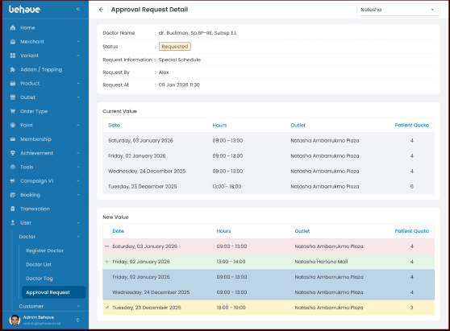
	
 - **Tampilan User Maker Request Update Time Off**
	 
	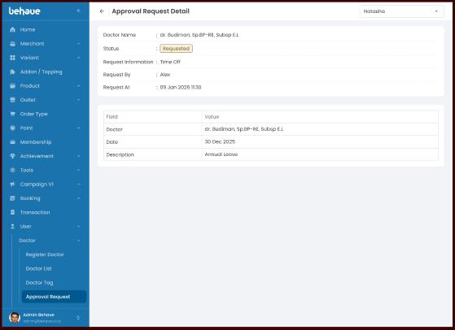

- **Tampilan User Approve Approval Update Detail Info**

	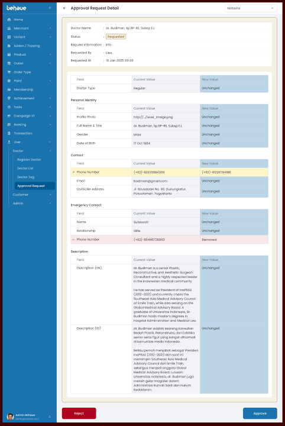

- **Tampilan User Approve Approval Update Detail Professioal & Exp**
	
	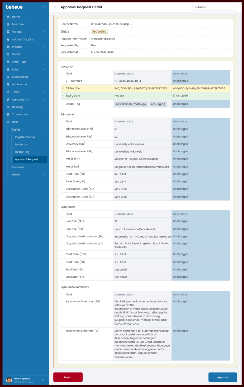

- **Tampilan User Approve Approval Update Weekly Schedule**
  
  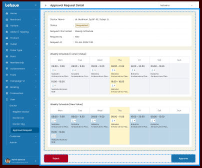
  
- **Tampilan User Approve Approval Update reject Weekly Schedule**

	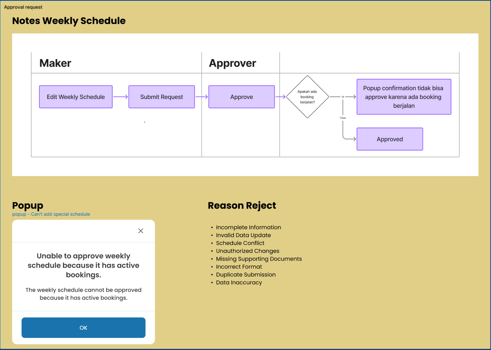

-  **Tampilan User Approve Approval Update Special Schedule**

	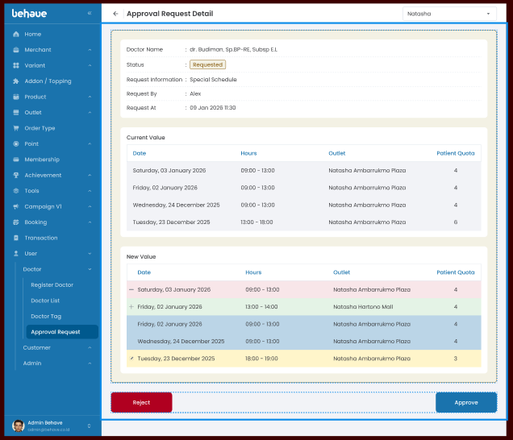

- **Tampilan User Approve Approval Update Time Off**

	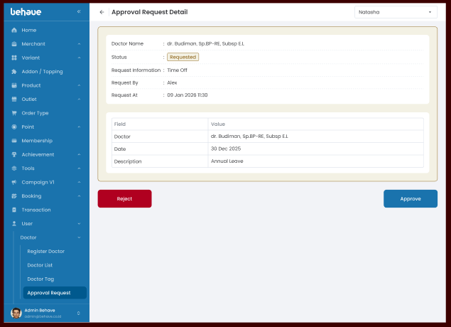

- **Tampilan User Approval Modal Confirmation**  
  
	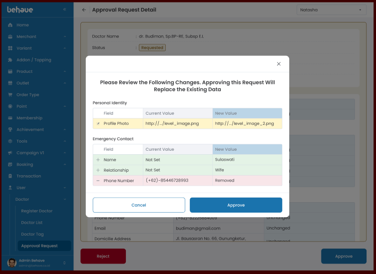
- **Tampilan User Approval Reject Modal Confirmation**
  
    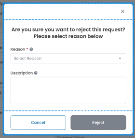
	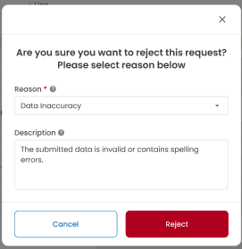
	
- **Tampilan User Approval Reject Modal Confirmation**
## Logic and UI/UX
- **Loading:** Saat load halaman maka berikan loader spinner.
- **Maker** Tampilan request didapat dari role pada user yang sedang login(jwt, session).
- **Approval:** Tampilan request didapat dari role pada user yang sedang login(jwt, session), memiliki action button dan backgorund form yang berbeda.
-  **Button Approve:** Saat klik button tersebut maka akan muncul modal sesuai dengan tampilan approve confirmation yang berisi data apa saja yang akan terupdate, setelah success maka akan kembali ke list awal.
- **Button Reject:** Saat klik button tersebut maka akan muncul modal sesuai dengan tampilan reject confirmation., , setelah success maka akan kembali ke list awal
## API Needs
- `API Approval Update Doctor Request`
- `API Reject Update Doctor Request blom terdefine mas bintang`
- `API Get Detail Update Doctor Request`