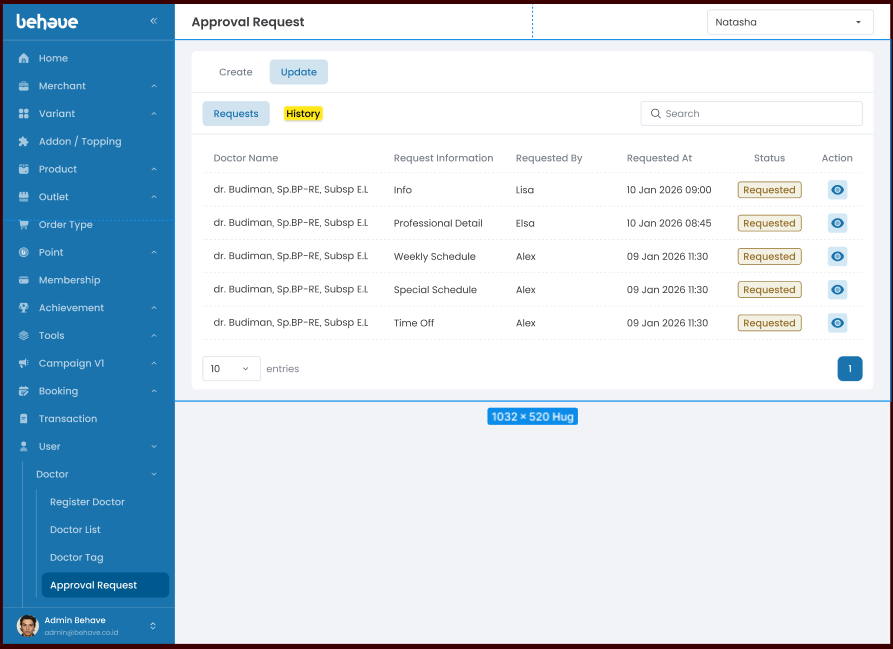

# List Create Doctor Request
## Overview
UI ini menampilkan list request update yang dilakukan oleh doctor untuk memperbaharui/update data yang baru.
## Requirement Visual
- **Approval Request**

	
## Logic and UX
- **Tab Header:** Tab active adalah "Update"
- **Tab Header Table:** Tab active adalah "Request"
- **Loading:** menampilkan spinner pada pada data table setiap memuat data baru.
- **Error:** menampilkan toast error/not found page
- **Empty State**: menampilkan data kosong pada data table.
- **Filled State:** menampilkan data list dengan state Tab button, request adalah aktif.
- **Search:** menampilkan data list sesuai dengan inputan search.