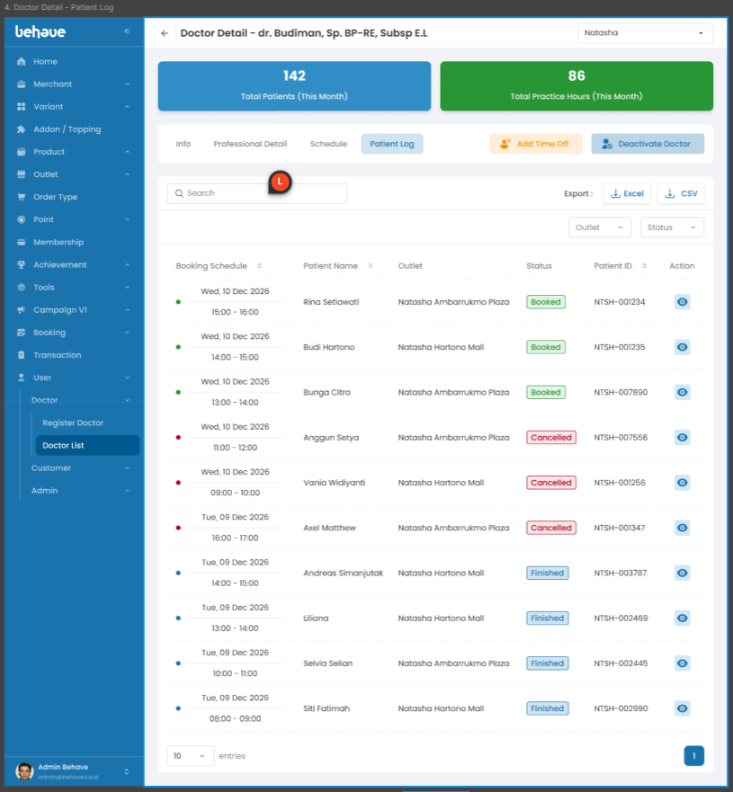

# Integrate UI Doctor Detail Tab Patient Log to API Download Booking List

## 1. Overview
Menampilkan seluruh daftar pasien dengan doctor terkait. Fitur yang terkait dengan api adalah fitur search, filter(outlet/status), export(Excel/Csv).
## 2. Requirement Visual
* Patient Log

	
## 3. Logic UI / UX
* **Loading State:** Muncul *skeleton loader* pada tabel saat *fetching* data.
* **Empty State:** Tampilkan ilustrasi "Data Kosong" jika array kembalian API kosong.
* **Error Handling:** Tampilkan *toast alert* warna merah jika API mengembalikan status 400.
* **Search:** Tampilkan data yang sesuai dengan inputan search.
* **Filter:** Tampilkan data sesuai dengan filter yang ada outlet, status.
* **Excel/CSV:** Download data sesuai dengan yang tampil di dalam list.
## 4. API Needs
* `API Get List Doctor Patient Log` - Mengambil list data pasien